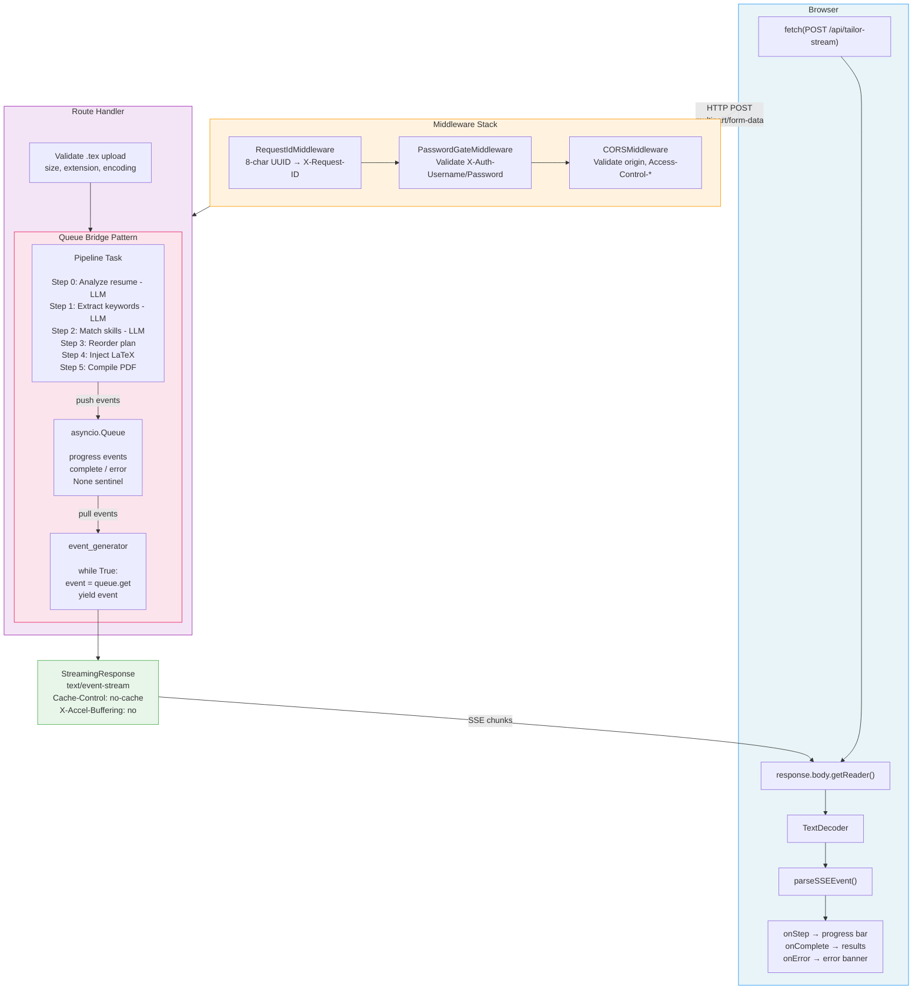

# Server-Sent Events (SSE)

How we stream real-time pipeline progress to the browser.

---

## Table of Contents

1. [What is SSE?](#what-is-sse)
2. [Why SSE Over Alternatives?](#why-sse-over-alternatives)
3. [Architecture Overview](#architecture-overview)
4. [Backend Implementation](#backend-implementation)
5. [Frontend Implementation](#frontend-implementation)
6. [Checks and Balances](#checks-and-balances)
7. [Event Protocol](#event-protocol)
8. [Key Files](#key-files)

---

## What is SSE?

**Server-Sent Events (SSE)** is a web standard that allows a server to push data to a browser over a single, long-lived HTTP connection. Unlike regular HTTP where the client sends a request and gets one response, SSE keeps the connection open and lets the server send multiple messages ("events") over time.

### How It Works (Plain English)

1. The browser makes an HTTP request to the server
2. The server responds with `Content-Type: text/event-stream` and **doesn't close the connection**
3. The server writes data in a specific text format, sending it in chunks
4. The browser reads each chunk as it arrives and fires JavaScript callbacks (see [Callback Pattern](#callback-pattern) below)
5. When the server is done, it closes the connection

### The SSE Wire Format

SSE events are plain text with a simple structure:

```
event: progress
data: {"step": 0, "label": "Analyzing resume..."}

event: progress
data: {"step": 1, "label": "Extracting keywords..."}

event: complete
data: {"pdf_url": "/output/resume.pdf", "match": {...}}

```

**Rules:**
- Each field is on its own line: `field: value`
- Events are separated by **two newlines** (`\n\n`)
- The `event:` field names the event type (like a channel)
- The `data:` field carries the payload (we use JSON)
- Lines starting with `:` are comments (often used as heartbeats)

### Why It Exists

Traditional HTTP is request-response: client asks, server answers, connection closes. But some operations take time and produce intermediate results (compilation progress, live logs, real-time notifications). SSE fills this gap without the complexity of WebSockets.

---

## Why SSE Over Alternatives?

| Approach | How It Works | Pros | Cons |
|----------|-------------|------|------|
| **Polling** | Client sends a new request every N seconds | Simple, works everywhere | Wastes bandwidth, delayed updates, server load |
| **Long Polling** | Client sends request, server holds it open until data is ready | Real-time-ish | One event per connection, reconnection overhead |
| **WebSockets** | Full-duplex bidirectional channel | Real-time, bidirectional | Complex setup, stateful, harder to debug, overkill for one-way data |
| **SSE** | Server pushes events over a single HTTP connection | Simple, built on HTTP, auto-reconnect, lightweight | One-way only (server → client), no binary data |

### Why SSE Wins for Resume Tailor

Our pipeline is a **one-way stream**: the server processes 6 steps and pushes progress updates to the browser. The browser never needs to send data back mid-stream. This is exactly what SSE is designed for.

**Specific reasons we chose SSE:**

1. **Unidirectional fits perfectly** — The browser sends one request (resume + JD), then just listens for 6 progress events and a final result. No bidirectional communication needed.

2. **HTTP-native** — SSE runs over standard HTTP. Works through proxies, load balancers, CDNs, and firewalls without special configuration. WebSockets require protocol upgrade negotiation that some proxies block.

3. **Simpler error handling** — HTTP status codes work normally. A 401 is a 401. With WebSockets, you'd need custom error frames.

4. **No persistent state** — Each request is independent. No connection pool, no heartbeat management, no reconnection protocol. The server doesn't track connected clients.

5. **Works with existing middleware** — Our CORS, rate limiting, auth, and request ID middleware all work unchanged. WebSockets bypass most HTTP middleware.

---

## Architecture Overview



[Open in Mermaid editor](https://mermaid.ai/live/edit?utm_source=mermaid_mcp_server&utm_medium=remote_server&utm_campaign=claude#pako:eNp1VOtu2koQfpUR_dMexSGB0AZLrcTFhEihJbbTVCpVtbHH4MOy6-6uS-jR-dsH6COeJznjNXYwaS2EvTPffHPZmfmnFckYW24r4XIbrZgyEA4XAujR-cNSsWwFQyW3GtXnRWv_tWh9KSHFMyF5giZavZx_CEJosyxtG5ZyqRxtFLLNqwbcDwivUGdSaDx9kPHudInGRxajetmEhmOChvhoxlgE2XQ7J13GlMYg8LzvKMyR8WhIACkCgxn89_MXZEouya2GB6YWCyHFSG4yjgatljQ5N9oqPKWkslK0Xw9MiOOcwXHeUSr2FY7ta27_R_vioYgX4qiOs3sKaZbGMcctUwiBYdG6wTs7J4SP33LU5jp-glJcl05xO3B3dz22sX1y9jjnetzk6BDHnGm9lSq-YgYbNB8ZT2MSkv0gNyvnjq5TsA22K4smV5e4Rh_84PccUqXLVJzAIIqoss5ICqMkd_46yskWZtYpX90_18efFtnLnJinTJC_ZtE_Dkhd-z41-Ah5xiWLKSSd_sAToFZB-pQUEgpqmVQsLcMTR-3rNscchyqNl0is9gTlEebMGCpKw3fxxKnCyBA73PhNzTwsSp5myFOBEDK9ppDoZ5vvzIWBYHz3A22XbRAcuLmZVepzF7xHo1hkYI274gZ0E9BxYcZovECvU86PlF0XfCQbVJBxVvu8cOFa_E3Rwg0L8VMl7rlQdH3KKcnx5FmCt5QF0zsRpfLUVqTMop4cLMasmJGoGp12OSIkei8pc016qgB_xuxdEbU1_7pEGiZmrBH9tqsimlDl6C4KGwuCt_Ct8F9sBivdpcjjUveMex5SYwEtg1yvqhBbttduj9KrcJw3cd7VE_CgL8ueK5meuuVZ-wY-5RbYTUf95u83G4VNDWra1tF-EZJsxKIVVoPigpBOVEhIQ_NIU8SdYZ4kqIip0B507371ljlMw3AOxbolww0trpQ2oWknUm0cGg62z2t2X5rO7st1NS2P3pU9Bn4Vf8lJexSiVS7WVVn8oJ5Qs-NYR5BQG7ov8DK5SC5PKDO5RvdF57z_etI9hJPXEpkkSRfPauRk0r88OztE-tMK2cVe0quR_VHnzbCBPLiHyiTCC4xqE69_7r1uhEHp1QH3sF8jL0aDSY_IW__-D3fNN9w)

### The Queue Bridge Pattern

The core design challenge: FastAPI's `StreamingResponse` expects an async generator that yields strings. But the pipeline is imperative code where each step depends on the previous step's output. You can't turn it into a generator.

**Solution:** An `asyncio.Queue` bridges the two:

- **Producer** — The pipeline runs as an `asyncio.Task`, calling LLMs and pushing `event: progress` strings into the queue after each step
- **Consumer** — The async generator pulls from the queue and yields to the HTTP response
- **Sentinel** — `None` signals "pipeline is done, close the stream"

This cleanly separates pipeline logic from streaming mechanics. The pipeline doesn't know it's being streamed. The generator doesn't know what the pipeline does.

---

## Backend Implementation

### Endpoint Definition

**File:** `backend/app/routes/tailor.py`

```python
@router.post("/tailor-stream")
@limiter.limit(f"{RATE_LIMIT_PER_MINUTE}/minute")
@observe(name="resume-tailor-stream")
async def tailor_resume_stream(
    request: Request,
    jd_text: str = Form(..., min_length=50),
    job_title: str = Form(default=""),
    company_name: str = Form(default=""),
    user_instructions: str = Form(default=""),
    resume_file: UploadFile = File(...),
):
```

- **Route:** `POST /api/tailor-stream`
- **Input:** Identical to `/api/tailor` — multipart form data with a `.tex` file and JD text
- **Decorators:** Rate limiting (10 req/min) + Langfuse tracing

### SSE Event Formatter

```python
def _sse_event(event: str, data: dict) -> str:
    """Format a single SSE event string."""
    return f"event: {event}\ndata: {json.dumps(data)}\n\n"
```

Takes an event name and data dictionary, returns a properly formatted SSE string. The double newline is the SSE delimiter that tells the browser "this event is complete."

### The Event Generator

```python
async def event_generator():
    queue: asyncio.Queue[str | None] = asyncio.Queue()

    async def on_step(index: int, label: str) -> None:
        await queue.put(_sse_event("progress", {"step": index, "label": label}))

    async def run_pipeline() -> None:
        try:
            result = await _execute_pipeline(
                raw_tex, jd_text, job_title, company_name,
                user_instructions, on_step=on_step,
            )
            await queue.put(_sse_event("complete", result.model_dump()))
        except PipelineError as e:
            await queue.put(_sse_event("error", {"detail": e.detail, "step": e.step}))
        except Exception as e:
            logger.error(f"Unexpected pipeline error: {e}", exc_info=True)
            await queue.put(_sse_event("error", {"detail": "Internal server error", "step": -1}))
        finally:
            flush()                    # Flush Langfuse traces
            await queue.put(None)      # Sentinel: stop the generator

    task = asyncio.create_task(run_pipeline())

    try:
        while True:
            if await request.is_disconnected():
                task.cancel()
                break
            try:
                event = await asyncio.wait_for(queue.get(), timeout=1.0)
            except asyncio.TimeoutError:
                continue
            if event is None:
                break
            yield event
    finally:
        if not task.done():
            task.cancel()
            try:
                await task
            except asyncio.CancelledError:
                pass
```

**How it works, step by step:**

1. Create an unbounded `asyncio.Queue` — events go in, generator pulls them out
2. Define `on_step` callback — the pipeline calls this at each step, pushing a progress event
3. Define `run_pipeline` — wraps the full pipeline, catches all errors, always puts `None` sentinel at the end
4. Spawn pipeline as a background task with `asyncio.create_task`
5. Generator loop: pull events from queue with 1-second timeout, yield each one to the HTTP stream
6. On `None` sentinel: break the loop, stream ends
7. Cleanup: cancel the pipeline task if it's still running

### StreamingResponse

```python
return StreamingResponse(
    event_generator(),
    media_type="text/event-stream",
    headers={
        "Cache-Control": "no-cache",
        "Connection": "keep-alive",
        "X-Accel-Buffering": "no",
    },
)
```

| Header | Purpose |
|--------|---------|
| `Cache-Control: no-cache` | Prevents browser/proxy from caching SSE events |
| `Connection: keep-alive` | Tells the client to keep the TCP connection open |
| `X-Accel-Buffering: no` | Disables Nginx buffering so events stream immediately (critical for reverse proxies) |

---

## Frontend Implementation

### Why `fetch()` Instead of `EventSource`

The browser has a built-in `EventSource` API for SSE:

```javascript
const source = new EventSource("/api/tailor-stream");
source.onmessage = (event) => { ... };
```

**We can't use it.** `EventSource` only supports GET requests. Our endpoint needs POST with `multipart/form-data` (file upload). There's no way to send a request body with `EventSource`.

Instead, we use `fetch()` with the Streams API to manually consume the SSE response.

### Stream Consumer

**File:** `frontend/src/lib/api.ts`

```typescript
async function consumeSSEStream(
  body: ReadableStream<Uint8Array>,
  callbacks: StreamCallbacks,
): Promise<void> {
  const reader = body.getReader();
  const decoder = new TextDecoder();
  let buffer = "";

  try {
    while (true) {
      const { done, value } = await reader.read();
      if (done) break;

      buffer += decoder.decode(value, { stream: true });

      // SSE events are separated by double newlines
      const parts = buffer.split("\n\n");
      buffer = parts.pop() ?? "";     // Keep incomplete event in buffer

      for (const part of parts) {
        if (!part.trim()) continue;
        const { event, data } = parseSSEEvent(part);
        if (!event || !data) continue;

        switch (event) {
          case "progress":
            callbacks.onStep(data as SSEProgressEvent);
            break;
          case "complete":
            callbacks.onComplete(data as TailorResponse);
            break;
          case "error":
            callbacks.onError(data as SSEErrorEvent);
            break;
        }
      }
    }
  } finally {
    reader.releaseLock();
  }
}
```

**How it works:**

1. Get a reader from `response.body` (a `ReadableStream<Uint8Array>`)
2. Create a `TextDecoder` to convert bytes to strings
3. Read chunks in a loop — each chunk may contain partial events, full events, or multiple events
4. Accumulate chunks in a buffer, split on `\n\n` (the SSE delimiter)
5. The last element after split may be incomplete — keep it in the buffer for the next chunk
6. Parse each complete event and dispatch to the appropriate callback
7. Release the reader lock in the `finally` block

### SSE Event Parser

```typescript
function parseSSEEvent(raw: string): { event: string | null; data: unknown } {
  let event: string | null = null;
  let dataStr = "";

  for (const line of raw.split("\n")) {
    if (line.startsWith("event: ")) {
      event = line.slice(7).trim();
    } else if (line.startsWith("data: ")) {
      dataStr += line.slice(6);
    }
  }

  try {
    return { event, data: dataStr ? JSON.parse(dataStr) : null };
  } catch {
    return { event: null, data: null };     // Gracefully skip malformed events
  }
}
```

### Callback Pattern

SSE events arrive **over time** — 7+ events spread across 15-20 seconds. A normal function returns one value and is done. Callbacks let the caller react to each event immediately as it arrives rather than waiting for the entire stream to finish.

**Defining the callbacks (interfaces):**

**File:** `frontend/src/lib/api.ts`

```typescript
export interface StreamCallbacks {
  onStep: (event: SSEProgressEvent) => void;      // Called on each "progress" event
  onComplete: (result: TailorResponse) => void;    // Called on the "complete" event
  onError: (error: SSEErrorEvent | Error) => void; // Called on the "error" event
}
```

**Passing the callbacks (caller side):**

**File:** `frontend/src/app/page.tsx`

The React component defines what should happen for each event type and passes these functions to `tailorResumeStream`:

```typescript
await tailorResumeStream(
  { jd_text, resume_file, ... },
  {
    onStep: (event) => {
      setStep(PIPELINE_STEPS[event.step]);   // Update progress bar
    },
    onComplete: (response) => {
      setResult(response);                    // Show results panel
      setLoading(false);                      // Hide spinner
    },
    onError: (err) => {
      setError(err.detail);                   // Show error banner
      setLoading(false);                      // Hide spinner
    },
  },
  controller.signal,
);
```

**Firing the callbacks (inside the stream consumer):**

When `consumeSSEStream` parses a complete event, it calls the matching callback:

```typescript
switch (event) {
  case "progress":
    callbacks.onStep(data);       // ← fires the onStep callback
    break;
  case "complete":
    callbacks.onComplete(data);   // ← fires the onComplete callback
    break;
  case "error":
    callbacks.onError(data);      // ← fires the onError callback
    break;
}
```

**The full chain:**

```mermaid
flowchart LR
    A["Server sends bytes"] --> B["reader.read()\nreturns chunk"]
    B --> C["TextDecoder\nbytes → string"]
    C --> D["buffer.split\nfinds complete events"]
    D --> E["parseSSEEvent()\nevent type + JSON"]
    E --> F["switch(event)\ncalls callback"]
    F --> G["React setState\nsetStep / setResult\nsetError"]
    G --> H["React\nre-renders UI"]

    style A fill:#e3f2fd,stroke:#1565C0
    style B fill:#e3f2fd,stroke:#1565C0
    style C fill:#e3f2fd,stroke:#1565C0
    style D fill:#fff8e1,stroke:#F9A825
    style E fill:#fff8e1,stroke:#F9A825
    style F fill:#fce4ec,stroke:#C62828
    style G fill:#e8f5e9,stroke:#2E7D32
    style H fill:#e8f5e9,stroke:#2E7D32
```



[Open in Mermaid editor](https://mermaid.ai/live/edit?utm_source=mermaid_mcp_server&utm_medium=remote_server&utm_campaign=claude#pako:eNqNkM9OwkAQh19lUi4YRaVYLBxMoH9AYzSherIeynZWGta22d2CxHj1AXxEn8TpIpWTYQ_dZvp9v5nOu8WKFK2hxUWxZotEaridxTnQGT3FVoRyhRIU5qmC-Uajiq1n6HSuYExfJSYpytP6ah_FcS5RVzJXwBZVviRwmzM2vEf8A75pH-uGkmgTB9-fX6C0zPKXRvCM4JMwrzinBqoUmSaDZ_UYrHgtBWoEXGGuVaP5RgtIKxOpMIqCoAbMZAYFvSkRjuEmur9rrMBYIVlqnWm2aBu0dlgiBHWj5zxhf78TGmFCwgwTpmk3OtKJRjLMK5ZwVhdnqCqht9VAykI2CROTMN0lmMV1JK0YpYLHa8NtSaU3AmEEPBNi2MIet3l6QtsqljhsdZ2-453vg-NDQe9Q0P8FOecudhswHIxc29kHg0PBcAcyvEDWgF7fdm13H5zsZnS5g4MGtINLv2fvg9P_QevjB82W63U)

**Why callbacks instead of return values?** It's the same pattern as `addEventListener("click", handleClick)` — you hand a function to someone else, and they call it when the event happens. Here, `consumeSSEStream` is the "someone else" and the SSE events are the triggers. The caller (page.tsx) decides *what to do* with each event; the stream consumer decides *when to fire*.

### Connection Setup with Timeout and Abort

```typescript
export async function tailorResumeStream(
  request: TailorRequest,
  callbacks: StreamCallbacks,
  signal?: AbortSignal,
): Promise<void> {
  const formData = new FormData();
  formData.append("jd_text", request.jd_text);
  formData.append("resume_file", request.resume_file);
  // ... other fields

  const controller = new AbortController();
  let timedOut = false;
  const timeoutId = setTimeout(() => {
    timedOut = true;
    controller.abort();
  }, 120_000);   // 120-second timeout

  // Chain user's abort signal to our controller
  if (signal) {
    signal.addEventListener("abort", () => controller.abort(), { once: true });
  }

  try {
    const response = await fetch(`${API_BASE}/api/tailor-stream`, {
      method: "POST",
      headers: getAuthHeaders(),
      body: formData,
      signal: controller.signal,
    });

    if (!response.ok) {
      const error = await response.json().catch(() => ({ detail: "Unknown error" }));
      throw new Error(error.detail || `API error: ${response.status}`);
    }

    await consumeSSEStream(response.body!, callbacks);
  } catch (err) {
    // ... error handling (see Checks and Balances)
  } finally {
    clearTimeout(timeoutId);
  }
}
```

### Progress UI

**File:** `frontend/src/app/page.tsx`

The UI shows a 6-dot progress bar where each dot represents a pipeline step:

```typescript
const PIPELINE_STEPS = [
  "Analyzing resume...",
  "Extracting keywords...",
  "Matching skills...",
  "Computing reorder plan...",
  "Injecting into LaTeX...",
  "Compiling PDF...",
];
```

- **Gray dot** — Step not started yet
- **Blue dot** — Current step (with animated spinner)
- **Green dot** — Step completed
- **Text label** — Current step name shown below the dots, marked with `aria-live="polite"` for screen readers

---

## Checks and Balances

Every failure mode is explicitly handled. Here's every check, why it exists, and what happens when it triggers.

### Backend Checks

#### 1. Input Validation (Before Stream Opens)

```python
# In _validate_upload()
if not filename.endswith(".tex"):
    raise HTTPException(400, "Only .tex files are accepted")
if content_type not in ("application/x-tex", "text/x-tex", "text/plain", ...):
    raise HTTPException(400, "Invalid content type")
if file_size > 2 * 1024 * 1024:  # 2 MB
    raise HTTPException(413, "File too large")
```

**Why:** Validation happens *before* the stream opens. If the file is invalid, the client gets a normal HTTP 400/413/422 error — not an SSE error event. This is important because the frontend handles pre-stream errors differently (via `response.ok` check) than mid-stream errors (via SSE error events).

#### 2. Rate Limiting

```python
@limiter.limit(f"{RATE_LIMIT_PER_MINUTE}/minute")
```

**Why:** Prevents abuse. Returns HTTP 429 before the stream opens. Default: 10 requests per minute per IP.

#### 3. Authentication Middleware

```python
class PasswordGateMiddleware:
    # Checks X-Auth-Username and X-Auth-Password headers
    # Returns 401 if invalid
    # Skips auth if AUTH_USERNAME is not configured
```

**Why:** Protects the endpoint from unauthorized access. Returns HTTP 401 before the stream opens. Uses pure ASGI middleware (not `BaseHTTPMiddleware`) to avoid buffering the streaming response.

#### 4. PipelineError Handling (During Stream)

```python
except PipelineError as e:
    await queue.put(_sse_event("error", {"detail": e.detail, "step": e.step}))
```

**Why:** Each pipeline step can fail (LLM timeout, invalid JSON response, compilation error). `PipelineError` carries the step index so the frontend knows which step failed. The error is sent as an SSE event, not an HTTP error, because the stream is already open (HTTP 200 was already sent).

#### 5. Unexpected Error Catch-All

```python
except Exception as e:
    logger.error(f"Unexpected pipeline error: {e}", exc_info=True)
    await queue.put(_sse_event("error", {"detail": "Internal server error", "step": -1}))
```

**Why:** Catches any error we didn't anticipate. Logs the full traceback for debugging. Sends a generic error to the client with `step: -1` (meaning "unknown step"). The client never sees internal error details.

#### 6. Sentinel Guarantee (finally block)

```python
finally:
    flush()                    # Flush Langfuse observability traces
    await queue.put(None)      # Always signal stream end
```

**Why:** The `None` sentinel is in a `finally` block, so it runs whether the pipeline succeeds, fails, or raises an unexpected error. Without this, the generator would block on `queue.get()` forever if the pipeline crashes without pushing an event.

#### 7. Client Disconnect Detection

```python
if await request.is_disconnected():
    task.cancel()
    break
```

**Why:** If the user closes the tab or navigates away, the server shouldn't keep running LLM calls and burning credits. The 1-second queue timeout exists specifically to check this — without the timeout, `queue.get()` would block and never check for disconnection.

#### 8. Task Cleanup on Disconnect

```python
finally:
    if not task.done():
        task.cancel()
        try:
            await task
        except asyncio.CancelledError:
            pass
```

**Why:** If the generator exits (client disconnect, sentinel received, or any exception), the pipeline task must be cancelled to avoid orphaned background work. We `await task` to ensure cancellation is complete before the generator function returns. `CancelledError` is expected and silenced.

#### 9. Non-Buffering Middleware

```python
"""Uses pure ASGI middleware (not BaseHTTPMiddleware) to avoid buffering
StreamingResponse, which is needed for the SSE endpoint."""
```

**Why:** Starlette's `BaseHTTPMiddleware` reads the entire response body into memory before sending it to the client. For SSE, this would mean the client sees nothing until the entire pipeline completes — defeating the purpose. Pure ASGI middleware wraps the `send` callable so each chunk flows through immediately.

#### 10. PDF Compilation Failure (Non-Fatal)

When pdflatex fails, the pipeline still emits `event: complete` with `pdf_error` set and `pdf_b64` empty. The user sees the tailored LaTeX, keywords, match score, and diff — they just can't download the PDF. This is intentional: a compilation failure shouldn't throw away 30 seconds of LLM work.

### Frontend Checks

#### 11. HTTP Error Before Stream Opens

```typescript
if (!response.ok) {
  const error = await response.json().catch(() => ({ detail: "Unknown error" }));
  throw new Error(error.detail || `API error: ${response.status}`);
}
```

**Why:** Validation errors (400), auth failures (401), rate limits (429), and server errors (500) are caught before attempting to read the stream. The `.catch()` handles cases where the error response isn't valid JSON.

#### 12. 120-Second Timeout

```typescript
const timeoutId = setTimeout(() => {
  timedOut = true;
  controller.abort();
}, 120_000);
```

**Why:** Prevents indefinite hangs if the server stops responding. 120 seconds is generous enough for a full pipeline run (~15-30 seconds) but catches actual stalls. The `timedOut` flag distinguishes timeout aborts from user-initiated cancels.

#### 13. User Cancellation via AbortController

```typescript
const handleCancel = useCallback(() => {
  abortRef.current?.abort();
  setLoading(false);
  setStep(null);
}, []);
```

**Why:** The user can click "Cancel" to abort mid-stream. The abort signal propagates through the fetch request, which causes the backend to detect disconnection and cancel the pipeline task. User-initiated aborts don't show an error message (silent cancel).

#### 14. Abort Signal Chaining

```typescript
if (signal) {
  signal.addEventListener("abort", () => controller.abort(), { once: true });
}
```

**Why:** The function accepts an external abort signal (from the React component) and chains it to the internal controller that also handles timeouts. This means both user cancel and timeout go through the same abort path.

#### 15. Network Error Detection

```typescript
if (err instanceof TypeError) {
  callbacks.onError(new Error("Cannot reach the server — is the backend running?"));
  return;
}
```

**Why:** `fetch()` throws `TypeError` when the server is unreachable (connection refused, DNS failure, CORS block). We give a helpful message instead of a cryptic error.

#### 16. Malformed SSE Event Handling

```typescript
try {
  return { event, data: dataStr ? JSON.parse(dataStr) : null };
} catch {
  return { event: null, data: null };     // Silently skip
}
```

**Why:** If the server sends a malformed event (corrupted JSON), the parser returns null and the event is skipped. This prevents a single bad event from crashing the entire stream.

#### 17. Partial Chunk Buffering

```typescript
const parts = buffer.split("\n\n");
buffer = parts.pop() ?? "";     // Keep the last (potentially incomplete) part
```

**Why:** TCP doesn't guarantee message boundaries. A single `reader.read()` call might return half an event, or two events, or one and a half events. The buffer accumulates data until a complete event (ending with `\n\n`) is found. Incomplete data stays in the buffer for the next read cycle.

#### 18. Reader Lock Release

```typescript
finally {
  reader.releaseLock();
}
```

**Why:** `ReadableStream` readers hold an exclusive lock. If the reader isn't released (e.g., due to an error), the stream becomes unusable. The `finally` block guarantees cleanup.

#### 19. Stale Request Prevention

```typescript
abortRef.current?.abort();           // Cancel any in-flight request
const controller = new AbortController();
abortRef.current = controller;
```

**Why:** If the user clicks "Tailor" while a previous request is still streaming, the old request is aborted before starting the new one. Without this, two streams could race and cause unpredictable UI state.

#### 20. Unexpected Stream Close Recovery

```typescript
// After tailorResumeStream returns (stream ended)
setLoading((prev) => {
  if (prev) {
    setStep(null);
    setRefining(false);
    abortRef.current = null;
  }
  return false;
});
```

**Why:** If the stream closes without emitting `complete` or `error` (e.g., server crash, network drop), the loading state would be stuck. This cleanup runs after the stream function returns regardless of outcome.

### Summary Table

| # | Check | Layer | When | What Happens |
|---|-------|-------|------|-------------|
| 1 | Input validation | Backend | Before stream | HTTP 400/413/422 |
| 2 | Rate limiting | Backend | Before stream | HTTP 429 |
| 3 | Password auth | Backend | Before stream | HTTP 401 |
| 4 | PipelineError | Backend | During stream | SSE error event with step |
| 5 | Unexpected error | Backend | During stream | SSE generic error, logged |
| 6 | Sentinel guarantee | Backend | Stream end | `None` in finally block |
| 7 | Client disconnect | Backend | During stream | Cancel pipeline task |
| 8 | Task cleanup | Backend | Stream end | Cancel + await task |
| 9 | Non-buffering middleware | Backend | Always | Pure ASGI, not BaseHTTPMiddleware |
| 10 | PDF failure non-fatal | Backend | Step 5 | Complete with empty PDF |
| 11 | HTTP error check | Frontend | Before stream | Parse error JSON, show message |
| 12 | 120s timeout | Frontend | During stream | Abort + timeout message |
| 13 | User cancel | Frontend | During stream | Silent abort, reset UI |
| 14 | Signal chaining | Frontend | Setup | External signal → internal controller |
| 15 | Network error | Frontend | Connection | "Cannot reach server" message |
| 16 | Malformed SSE | Frontend | During stream | Skip bad event silently |
| 17 | Partial chunk buffer | Frontend | During stream | Accumulate until `\n\n` |
| 18 | Reader lock release | Frontend | Stream end | `finally` block cleanup |
| 19 | Stale request abort | Frontend | New request | Cancel previous stream |
| 20 | Unexpected close | Frontend | Stream end | Reset loading state |

---

## Event Protocol

Three event types flow over the SSE stream:

### `progress`

Emitted once at the start of each pipeline step (6 times total).

```
event: progress
data: {"step": 0, "label": "Analyzing resume..."}
```

| Field | Type | Description |
|-------|------|-------------|
| `step` | `int` | Step index (0-5) |
| `label` | `string` | Human-readable step name |

**Step labels:**

| Step | Label | Type | Duration |
|------|-------|------|----------|
| 0 | Analyzing resume... | LLM | ~5s |
| 1 | Extracting keywords... | LLM | ~3s |
| 2 | Matching skills... | LLM | ~4s |
| 3 | Computing reorder plan... | Deterministic | <100ms |
| 4 | Injecting into LaTeX... | Deterministic | <100ms |
| 5 | Compiling PDF... | Subprocess (pdflatex) | ~2s |

Steps 0 and 1 run in parallel via `asyncio.gather`. Total pipeline time: ~14-20 seconds.

### `complete`

Emitted once when the pipeline succeeds.

```
event: complete
data: {"extracted": {...}, "match": {...}, "pdf_b64": "...", "tex_content": "...", ...}
```

| Field | Type | Description |
|-------|------|-------------|
| `extracted` | `ExtractedKeywords` | JD keywords grouped by category |
| `match` | `MatchResult` | Matched/missing keywords + match score |
| `reorder_plan` | `ReorderPlan` | How sections were reordered |
| `pdf_url` | `string` | Server path to compiled PDF |
| `pdf_b64` | `string` | Base64-encoded PDF (empty if compilation failed) |
| `pdf_error` | `string` | PDF compilation error message (empty if success) |
| `tex_content` | `string` | Full tailored LaTeX source |
| `tex_diff` | `string` | Unified diff of LaTeX changes |
| `filename` | `string` | Suggested filename |
| `processing_time_ms` | `int` | Total pipeline time in milliseconds |

### `error`

Emitted once if any step fails (replaces `complete`).

```
event: error
data: {"detail": "Resume analysis failed", "step": 0}
```

| Field | Type | Description |
|-------|------|-------------|
| `detail` | `string` | Human-readable error message |
| `step` | `int` | Which step failed (-1 for unexpected errors) |

### Event Sequence Examples

**Happy path:**
```
event: progress  →  step 0
event: progress  →  step 1
event: progress  →  step 2
event: progress  →  step 3
event: progress  →  step 4
event: progress  →  step 5
event: complete  →  full result
[stream closes]
```

**Pipeline failure at step 2:**
```
event: progress  →  step 0
event: progress  →  step 1
event: progress  →  step 2
event: error     →  {"detail": "Matching failed", "step": 2}
[stream closes]
```

**PDF compilation failure (non-fatal):**
```
event: progress  →  step 0 through 5
event: complete  →  result with pdf_b64="" and pdf_error="pdflatex exited with code 1"
[stream closes]
```

---

## Key Files

| File | What It Does |
|------|-------------|
| `backend/app/routes/tailor.py` | SSE endpoint, event generator, queue bridge, pipeline orchestration |
| `backend/app/middleware.py` | Pure ASGI middleware (non-buffering) for request ID and auth |
| `backend/app/main.py` | Middleware stack ordering, CORS configuration |
| `backend/app/core/constants.py` | `PIPELINE_STEP_LABELS` — the 6 step names |
| `backend/app/models.py` | `TailorResponse` — the `complete` event payload schema |
| `frontend/src/lib/api.ts` | `tailorResumeStream()`, `consumeSSEStream()`, `parseSSEEvent()` |
| `frontend/src/app/page.tsx` | UI state management, progress display, cancel/abort handling |
| `frontend/src/lib/types.ts` | `SSEProgressEvent`, `SSEErrorEvent`, `StreamCallbacks` TypeScript interfaces |

### Related Documentation

- [Design Decisions](design-decisions.md) — Why we chose asyncio.Queue, pure ASGI middleware, fetch over EventSource, PipelineError over HTTPException
- [Architecture](architecture.md) — Full request lifecycle including SSE
- [Error Handling](error-handling.md) — How errors propagate through the system
- [Security](security.md) — CORS, rate limiting, auth middleware that interact with SSE
